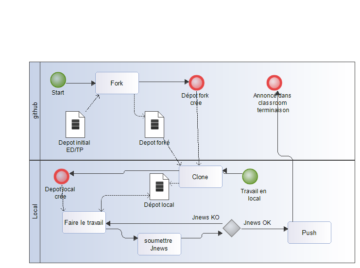

# Le TP introductif

**Si vous avez des problèmes ou des questions**

* concernant ce TP le soumette ici [J'ai un Problème](https://github.com/ISSAE/nfp121.tp1/issues/new) avec un label soit "help wanted" ou "question"
* Concernant le cours NFP121 en général dans la [classroom](http://classroom.isae.edu.lb)

## <a id="prerequis">[Verifier/installer les pré-requis](travail#prerequis)

1. Verifier que git  et bluej bien installé
2. Vous poss;eder un compte github et une prganisation nfp121-<centre>-<matricule> voir le tp0 en cas de problème [Vers le tp0](https://issae.github/nfp121.tp0/tarvail)
3. Verifier ou Inscrivez vous à la JNEWS (c'était un devoir dans http://classroom.isae.edu.lb) voici le lien [vers le texte du devoir](https://classroom.google.com/u/0/c/MjA3MDIxODgyODZa/a/MzA3MTIxMTUzMDBa/details)

## <a id="quoi">[Le travail demandé](travail#quoi)

Voici le [sujet du TP 1](tp1/)

### <a id="fork">[Faire un fork dans votre propre organisation](travail#fork)

Faire un fork de ISSAE/nfp121.tp1 dans votre organisation dédié à nfp121

### <a id="clone">[Cloner en local votre fork](travail#clone)

### Créer un projet avec blueJ dans le répertoire nfp121.tp1 que vous avez récupérer après le clone

1. Lancer BlueJ, 
2. Ouvrir le projet <RacineDesGits>/nfp121.tp1/tp1
2. faire les 3 questions Voici le [sujet du TP 1](tp1/)

#### Processus pour les TP ...

### <a id="jnews">[soumission a JNEWS](travail#jnews)

A faire dans bluej

### <a id="push">[Finir en faisant push dans votre fork](travail#push)

git push .... 

### <a id="avertir">[Avertir l'enseignant dans la classroom de la fin du travail](travail#avertir)

### <a id="pullrequest">[optionnellement faire un pull request](travail#pullrequest)

